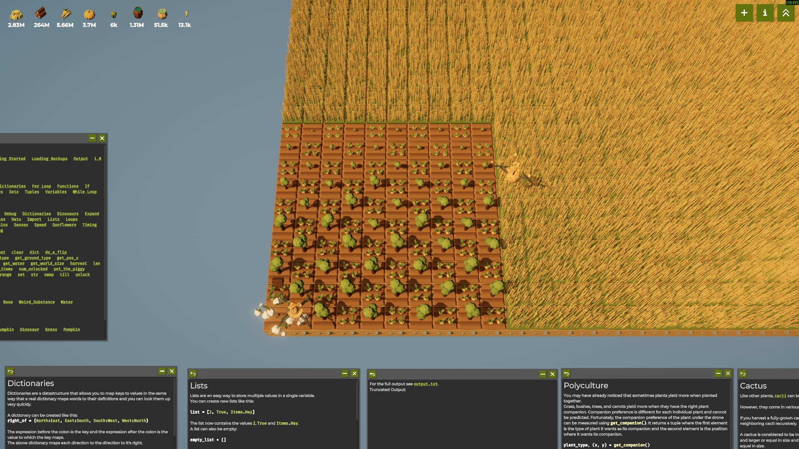
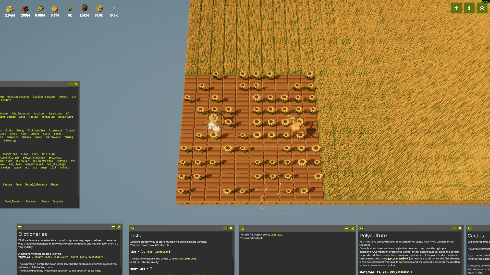
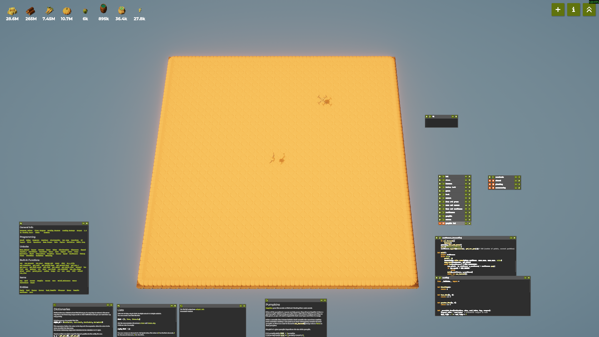

# The Farmer Was Replaced

**The Farmer Was Replaced** is a Python-like programming/automation game about farming with drones. The game can be
found on Steam here: <https://store.steampowered.com/app/2060160/The_Farmer_Was_Replaced/>.

The API consists solely of what is defined in [\_\_builtins\_\_.py](__builtins__.py).

This repository contains the scripts I developed during my playthrough of the game.

## Highlights

### Checkered Trees

Trees grow slower if adjacent to other trees.

### Descending Sunflowers

Sunflowers need to be harvested in descending order of their number of petals.

### 32 x 32 Pumpkin

Pumpkins have a chance to die when fully grown, but if survived, can merge with neighbouring pumpkins to form squares.

